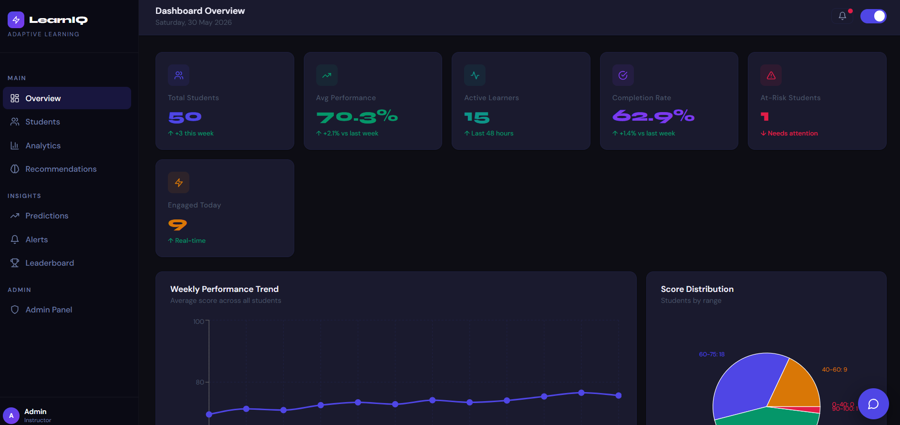
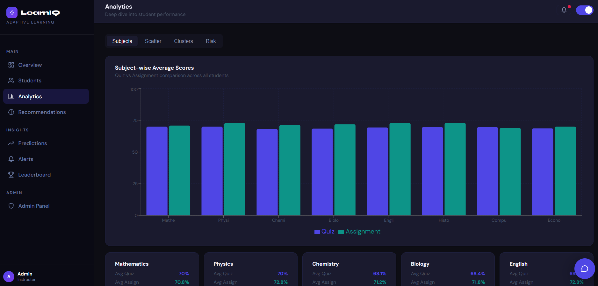
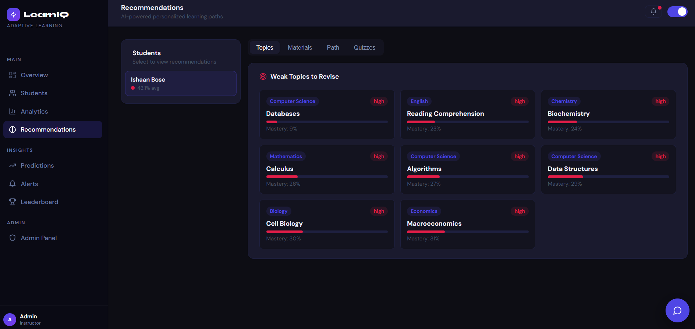
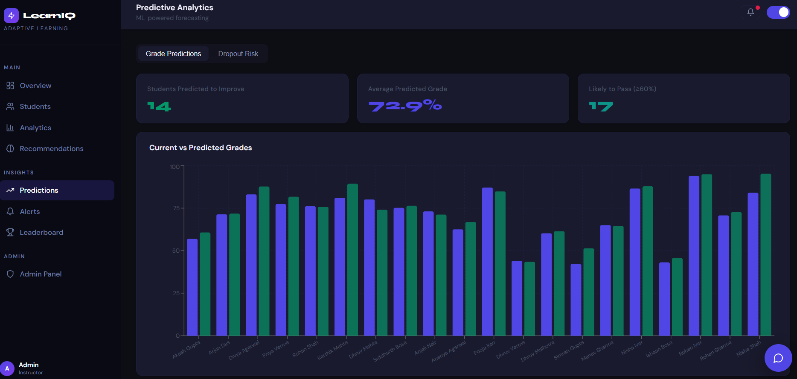

# 🎓 LearnIQ — Adaptive Learning Recommendation Framework

A full-stack AI-powered student analytics and adaptive learning platform.

---
## Problem Statement

Teachers often struggle to identify at-risk students early, monitor engagement across large classrooms, and provide personalized learning support.
Traditional gradebooks show scores but rarely provide actionable insights.
LearnIQ was built to combine student analytics, machine learning, and adaptive recommendations into a single platform that helps educators identify learning gaps, predict risks, and support student success.

---
## 🗂️ Project Structure

```
adaptive-learning/
│
├── backend/
│   ├── main.py                      # FastAPI entry point
│   ├── requirements.txt
│   ├── .env                         # environment variables (optional but good practice)
│   │
│   ├── app/
│   │   ├── core/
│   │   │   └── config.py            # config settings
│   │   │
│   │   ├── models/
│   │   │   └── database.py          # simulated DB / data layer
│   │   │
│   │   ├── ml/
│   │   │   ├── clustering.py        # K-Means logic
│   │   │   ├── prediction.py        # dropout + grade prediction
│   │   │   └── recommender.py       # recommendation engine
│   │   │
│   │   ├── routes/
│   │   │   ├── students.py
│   │   │   ├── analytics.py
│   │   │   ├── recommendations.py
│   │   │   ├── predictions.py
│   │   │   ├── alerts.py
│   │   │   └── admin.py
│   │   │
│   │   └── utils/
│   │       └── helpers.py
│   │
│   └── tests/                       # optional (but adds credibility)
│
├── frontend/
│   ├── package.json
│   ├── public/
│   │   └── index.html
│   │
│   ├── src/
│   │   ├── assets/
│   │   │   └── images/              # frontend images/icons (optional)
│   │   │
│   │   ├── components/
│   │   │   └── common/
│   │   │       ├── Sidebar.js
│   │   │       ├── Topbar.js
│   │   │       └── Chatbot.js
│   │   │
│   │   ├── pages/
│   │   │   ├── Overview.js
│   │   │   ├── Students.js
│   │   │   ├── StudentProfile.js
│   │   │   ├── Analytics.js
│   │   │   ├── Recommendations.js
│   │   │   ├── Predictions.js
│   │   │   ├── Alerts.js
│   │   │   ├── Leaderboard.js
│   │   │   └── Admin.js
│   │   │
│   │   ├── context/
│   │   │   └── ThemeContext.js
│   │   │
│   │   ├── utils/
│   │   │   └── api.js
│   │   │
│   │   ├── App.js
│   │   ├── index.js
│   │   └── index.css
│   │
│   └── .env
│
├── images/                          # ALL README screenshots go here
│   ├── dashboardpng
│   ├── Students
│   ├── Aalytics.png
│   ├── Rcommendations.png
│   └── Pedictions.png
│
├── README.md
├── .gitignore
└── LICENSE (optional but recommended)
```

---

## ⚙️ Setup Instructions (VS Code)

### Prerequisites
- Python 3.9+ installed
- Node.js 16+ and npm installed
- VS Code with Python and ESLint extensions (optional but recommended)

---

### 1️⃣ Backend Setup

Open a terminal in VS Code and run:

```bash
cd adaptive-learning/backend

# Create virtual environment
python -m venv venv

# Activate it
# Windows:
venv\Scripts\activate
# macOS/Linux:
source venv/bin/activate

# Install dependencies
pip install -r requirements.txt

# Start the backend server
python main.py
```

Backend runs at: **http://localhost:8000**
API docs at: **http://localhost:8000/docs**

---

### 2️⃣ Frontend Setup

Open a **new terminal** in VS Code:

```bash
cd adaptive-learning/frontend

# Install Node dependencies
npm install

# Start the React dev server
npm start
```

Frontend runs at: **http://localhost:3000**

---

## 🚀 Features

| Feature | Description |
|---|---|
| 📊 Overview Dashboard | Stats, trends, pie charts, alerts |
| 👥 Student Management | Search, filter, sort 50 students |
| 🧑 Student Profile | Radar charts, subject scores, risk |
| 📈 Analytics | Subject analytics, scatter, clusters, risk |
| 🧠 Recommendations | AI-generated topics, materials, paths |
| 🔮 Predictions | Grade & dropout prediction charts |
| 🚨 Alerts | Auto smart alerts by type |
| 🏆 Leaderboard | Gamified rankings with badges |
| 🛡️ Admin Panel | Dashboard + CSV export |
| 🤖 AI Chatbot | Floating assistant with smart replies |
| 🌙 Dark Mode | Toggle with smooth theme transition |

---
## 📸 Screenshots

### Dashboard


---

### Analytics


---

### 👤 Student Profile — Individual Performance Analytics


---

### 🧠 Recommendations Engine — AI Learning Suggestions


---

### 🔮 Predictions Dashboard — Risk & Performance Forecasting


---

## 🔌 API Endpoints

| Method | Path | Description |
|---|---|---|
| GET | /api/analytics/overview | Dashboard stats |
| GET | /api/analytics/subjects | Subject averages |
| GET | /api/analytics/scatter | Study time vs score |
| GET | /api/analytics/clusters | K-Means groups |
| GET | /api/analytics/risk | Risk probabilities |
| GET | /api/students/ | List all students (with filters) |
| GET | /api/students/{id} | Single student |
| GET | /api/students/{id}/profile | Full profile |
| GET | /api/students/{id}/recommendations | AI recommendations |
| GET | /api/students/{id}/predictions | Grade predictions |
| GET | /api/students/leaderboard | Top 10 leaderboard |
| GET | /api/alerts/ | Smart alerts |
| GET | /api/predictions/grades | Grade forecast |
| GET | /api/predictions/dropout-risk | Dropout ranking |
| GET | /api/admin/dashboard | Admin stats |
| GET | /api/admin/export/summary | CSV export data |

---

## 🤖 ML Models Used

- **K-Means Clustering** — Groups students into 4 performance tiers
- **Logistic Regression** — Predicts dropout/at-risk probability
- **Linear Trend Analysis** — Forecasts future grade scores
- **Topic Mastery Rules** — Recommends weak topic revision
- **Collaborative Filtering** — Suggests personalized study materials

---

## 🎨 Tech Stack

- **Frontend:** React 18, React Router, Recharts, Lucide Icons
- **Backend:** FastAPI (Python), Uvicorn
- **ML:** Scikit-learn, NumPy, Pandas
- **Styling:** Pure CSS with CSS Variables (dark/light modes)
- **State:** React Context API

---

## 💡 VS Code Tips

- Open the folder: `File → Open Folder → adaptive-learning/`
- Split terminals: one for backend, one for frontend
- Install extension **REST Client** to test API endpoints
- Use **Python: Select Interpreter** to pick your venv
